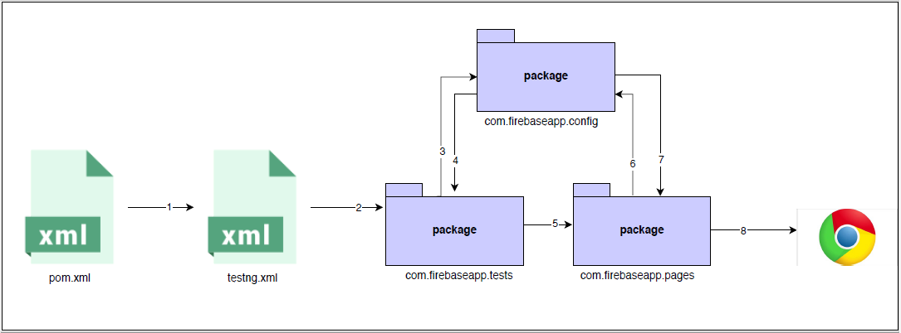

# README #

### About the repository ###
* This repository contains automated tests for 'coherent-tree (nimble-tree)' web application.

### Scope of test scripts ###
* Home page elements
* Valid Login
* Logout
* User dashboard elements
* User api key

### Prerequisite ###
* Java installed
* JAVA_HOME environment variable configured
* Maven installed
* MAVEN_HOME environment variable configured
* Google Chrome web browser installed

### Technologies used ###
* Java
* Maven
* TestNG
* Selenium WebDriver
* Web Driver Manager

### How do I get set up ###
* Download the repository into system.
* Unzip the repository

### How to execute tests ###
* Open command-line. Go to project directory. Execute below command:
```
mvn clean test
```

### Project architecture ###


### Who do I talk to ###
* For more information contact: Atinder Aujla at [atinder.aujla@outlook.com](mailto:atinder.aujla@outlook.com)
